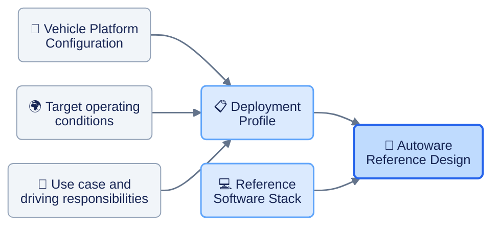

# Proposal for Autoware Reference Design Terminology

Status: Draft for discussion

Date: 30 September 2026

**Autoware Reference Design = Deployment Profile + Reference Software Stack**

**Deployment Profile:** Describes the vehicle platform, target operating conditions, and use case.

**Reference Software Stack:** Specifies the reusable software baseline.

**Autoware Reference Design:** Brings them together into a complete system blueprint and documents how the combination is integrated and evaluated.

This proposal defines these terms and explains how they support different vehicles, operating conditions, and software configurations.

The initial discussion should establish what each artifact contains and how the artifacts relate. Naming individual offerings follows that agreement.

## Autoware Reference Design

> An Autoware Reference Design is a documented, versioned blueprint for building and evaluating an Autoware-based driving system for a specified use case and Operational Design Domain. It specifies the vehicle and hardware configuration, software configuration, integration requirements, evaluation criteria, available evidence, and known limitations.

This retains the system scope already present in the [PoV](https://autowarefoundation.github.io/autoware.pov-reference-design-docs/main/) and [LSA](https://autowarefoundation.github.io/LSA-reference-design-docs/main/) guidelines, while making its engineering deliverables clearer.

A system definition can include software while documenting that software separately. The composition becomes clear when the documentation identifies which combinations form complete systems and which combinations are supported.

## Deployment Profile

> A Deployment Profile describes the intended application and operating conditions for a specified vehicle platform and hardware configuration, against which software configurations can be integrated and evaluated.

This is a proposed **Autoware terminology choice**, rather than a claim that the term has this established industry meaning.

For example:

> **Campus shuttle deployment profile:** a specified shuttle platform with LiDAR, cameras, GNSS/IMU, and a defined compute platform, intended for paved campus routes in daylight and dry weather, up to 15 km/h.

Several software configurations could be evaluated against that profile.

The profile groups two independently reusable definitions for a particular application:

| Artifact | What it specifies |
| --- | --- |
| **Vehicle Platform Configuration** | Vehicle, sensors, compute, actuation, and hardware interfaces |
| **ODD Specification** | Operating conditions and their boundaries |

The same platform can appear in several profiles, and the same operating-condition specification can be used with several platforms.

**Hardware plus desired operating conditions does not establish that the system can operate there.** An ODD describes conditions a particular driving system or feature is designed to handle; it is not simply a property of the vehicle. That relationship is explicit in the [ASAM OpenODD definitions](https://publications.pages.asam.net/standards/ASAM_OpenODD/ASAM_OpenODD/latest/specification/03_terms_and_definitions/03_terms_and_definitions.html).

Consequently, the deployment profile states the target. The integrated reference design records its specified ODD and the evidence supporting its operation within that scope.

Deployment Profile is useful when comparing software candidates against the same vehicle and operating target. Where that grouping is unnecessary, a reference design can refer directly to its platform configuration and ODD specification.

## Reference Software Stack

> A Reference Software Stack is a software configuration that Autoware publishes and maintains as a recommended baseline, with documented interfaces, platform requirements, and evaluation scope.

A **software configuration** specifies the selection and arrangement of software modules, models, versions, and parameters. It becomes a **Reference Software Stack** when Autoware publishes and maintains it as a recommended baseline.

This gives “reference” a meaningful role. Users can create many software configurations; the Foundation can choose a manageable set to maintain as reference stacks.

The same software baseline may be used on several vehicle platforms, and the same vehicle may be used to compare several software approaches. Maintaining a shared software definition avoids copying and eventually diverging the same configuration across multiple design documents.

### Example reference software stacks

The following examples illustrate candidate software baselines. Their names and compositions are proposals; complete manifests and supported deployment profiles remain to be specified.

| Example | Proposed software composition |
| --- | --- |
| **Rule-based Planning Stack** | Sensing, localization, and perception connected to rule-based behavior and motion planning, trajectory control, the vehicle interface, and supporting system modules. The name describes the planning approach; perception may still use learned models. |
| **Diffusion Planning Stack** | Localization and perception connected to a specified diffusion planner, with trajectory checking, control, the vehicle interface, and supporting system modules. The configuration identifies the planner's required inputs and model version. |
| **Meteor-based Stack** | A specified Meteor model and inference runtime, integrated with the required input/output adapters and supporting Autoware modules. The configuration defines which functions Meteor supplies and which functions the surrounding modules provide. |
| **Vision Pilot** | AutoSteer, AutoSpeed, and AutoDrive, together with an explicit selection of supporting Autoware modules, runtime dependencies, and interfaces. |
| **Fusion Pilot** | AutoE2E together with the required input processing, inference runtime, output adapters, and supporting Autoware modules. The configuration specifies the sensor inputs and how the complete driving pipeline is assembled. |

Each example must identify the complete module composition, software and model versions, parameters, required interfaces, and platform assumptions before it can be published as a maintained reference stack. A model or planner name alone does not define the complete stack.

These examples describe software choices. Their use with a particular vehicle, ODD, and automation target is specified and evaluated within a Reference Design.

## Specifying and evaluating a reference design

Each reference design should answer six questions:

| Question | Required information |
| --- | --- |
| What is it supposed to do? | Driving functions, use case, intended automation level, and driver/operator responsibilities |
| Under what conditions? | ODD boundaries, assumptions, and exclusions |
| On what platform? | Vehicle characteristics, sensors, compute, actuation, and interfaces |
| With which software? | Selected modules and models, versions, parameters, and runtime dependencies |
| How are the parts integrated? | Interfaces, calibration, timing, resource requirements, maps, and deployment instructions |
| What has been demonstrated? | Evaluation criteria, tested configurations, results, and limitations |

A design can begin as a draft. Its status should state what has been implemented and evaluated. **Reference design alone should not imply demonstrated Level 4 capability or production readiness.**

A reference design need not mandate one vehicle manufacturer. It can specify platform requirements and provide concrete implementations that satisfy them. A published implementation should be specific enough for another engineer to reproduce it.

## Configurations and variants

Autoware should make configurations easy to compose and publish compatibility and evaluation information for the combinations it supports. Composability does not establish that every possible combination works.

For example, the following could be candidate variants of a campus-shuttle reference design:

| Variant | Deployment profile | Software choice |
| --- | --- | --- |
| A | Campus shuttle platform and operating target | Modular software with rule-based planning |
| B | Campus shuttle platform and operating target | Modular software with a diffusion planner |
| C | Campus shuttle platform and operating target, subject to Meteor's platform requirements | Meteor-based configuration |
| D | Campus shuttle platform with cameras and radar, targeting campus operation | Modular software with camera–radar perception and rule-based planning |

These are illustrative combinations, not claims of existing compatibility.

Each variant needs its own configuration identity and evaluation scope. Changing the planner, sensor placement, vehicle dynamics, or model weights can affect system behavior. Existing evidence can be reused where justified, but it should not automatically transfer to the new combination.

A reference design can contain a baseline and explicitly documented variants. This avoids creating a new brand for every variation. Broad categories such as urban robotaxi, highway assistance, and low-speed shuttle can organize the catalog into **reference-design families**.

Within that catalog, use independent attributes:

- Application and driving responsibilities.
- ODD.
- Vehicle platform.
- Sensor configuration.
- Software architecture and selected implementations.
- Evaluation status.

“Camera-only,” “robotaxi,” “diffusion planner,” and “simulation-tested” then occupy different fields rather than competing to be the primary category.

Rule-based, diffusion-based, and Meteor-based configurations fit this structure without requiring a new Pilot name for each one. This also fits the composability described in [Autoware's architecture documentation](https://github.com/autowarefoundation/autoware-documentation/blob/main/docs/design/autoware-architecture-v2/roadmap/detailed-architectural-interface.md).

## Initial board discussion

The initial meeting should seek agreement on four concrete decisions:

1. **Agree on the system boundary.** A reference design covers the application, ODD, platform, software, integration, and evaluation.
2. **Agree on the reusable parts.** Platform configurations, ODD specifications, and software configurations can be referenced by multiple designs. Decide whether Deployment Profile is a useful grouping for the intended workflows.
3. **Agree on what Autoware maintains.** Define the minimum contents and ownership required to call a design or software stack an official reference.
4. **Test the definitions against actual examples.** Describe one rule-based configuration, one learned-planner configuration, and one camera-based configuration using the same template. Record unknowns explicitly.

The practical test is whether an engineer can identify the software, build the system, understand its intended operating conditions, and determine what has actually been evaluated. If the definitions cannot support those tasks, changing the names will not resolve the disagreement.

The proposed opening for the discussion is:

> Let's define a Reference Design as the complete system blueprint. It can reuse a separately maintained Reference Software Stack and a Deployment Profile describing its platform and operating target. Each supported combination must identify its integration requirements and evaluation scope. We should agree on these relationships and fill in concrete examples before deciding the names of individual offerings.
